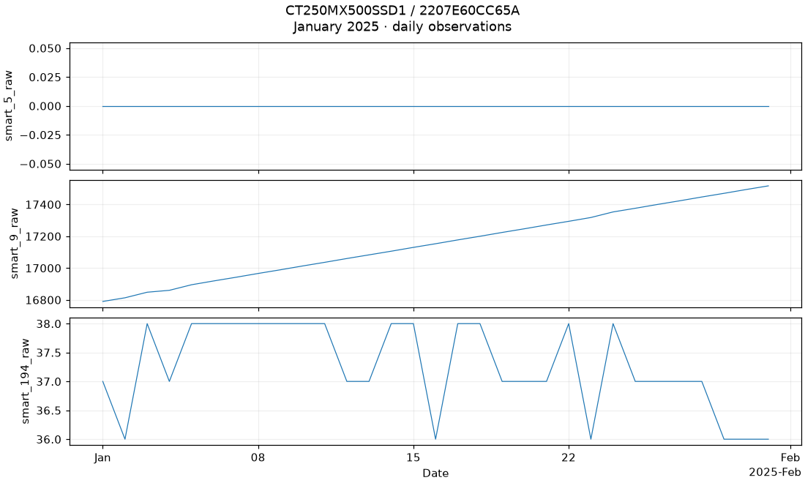
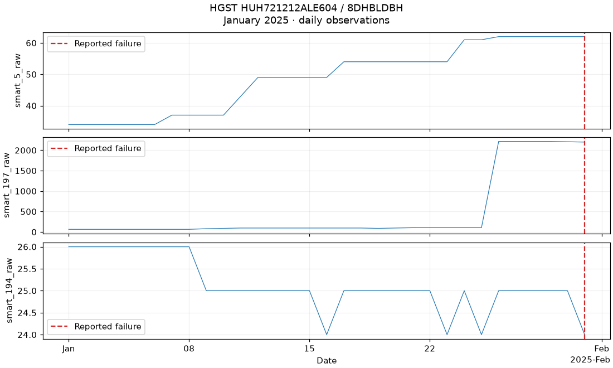

# Backblaze Drive Stats

<!-- BEGIN GENERATED METADATA -->

## Dataset overview

Daily fleet-scale snapshots of hard drives and SSDs, including device identity, model, failure status, and raw and normalized S.M.A.R.T. statistics.

| Item | Details |
|---|---|
| ID | `backblaze` |
| Name | Backblaze Drive Stats |
| Provider | [Backblaze](https://www.backblaze.com/cloud-storage/resources/hard-drive-test-data) |
| DOI | — |
| Availability | available (checked: 2026-07-25) |
| Access | Direct quarterly downloads |
| License | [Backblaze Drive Stats terms](https://www.backblaze.com/cloud-storage/resources/hard-drive-test-data) |
| Commercial use | Yes |
| Redistribution | Unknown |
| Data type | Fleet-scale daily reliability panel |
| Feature dimensions | Variable by quarter and drive model; e.g. 100 SMART fields in the 2018 Q1 schema |
| Feature counting | Counts each raw and normalized SMART field separately (50 pairs in 2018 Q1). Date, serial number, model, capacity, and failure target are excluded. Later quarters have different schemas, and many SMART fields are missing for individual models; select columns from the actual downloaded quarter. |
| Feature-count source | [Backblaze quarterly schemas](https://f001.backblazeb2.com/file/Backblaze-Hard-Drive-Data/Drive_Stats_Schema_2018_Onward.csv) |
| Tasks | Drive failure prediction, Survival analysis, Time-to-event prediction |

## Experiment-task suitability

| Task | Support |
|---|---|
| Anomaly detection | Requires target derivation |
| Fault or health-state classification | Direct |
| Condition estimation | Requires target derivation |
| Remaining useful life prediction | Requires target derivation |
| Time-to-event prediction | Direct |
| Survival analysis | Direct |

## Attributes

| Attribute or group | Type | Role | Description |
|---|---|---|---|
| `date` | Date | time | UTC date of the daily drive snapshot. |
| `serial_number` | String | entity | Drive serial number used to construct longitudinal device histories. |
| `model / capacity_bytes` | String/UInt64 | asset-attribute | Drive model and capacity. |
| `failure` | UInt8 | target | One on the final day a drive is observed before a reported failure, otherwise zero. |
| `smart_*_raw / smart_*_normalized` | Float64 | sensor | Raw and normalized S.M.A.R.T. attributes; availability varies by drive model and quarter. |

## Usage notes

- Data are partitioned by quarter to avoid requiring a full-history download.
- The default variant is 2025-q1; specify another quarter explicitly when required.
- Schema changes occur over time and S.M.A.R.T. attributes are highly sparse across drive models.
- Backblaze permits derivative works but asks users not to sell the source data itself.
- Quarterly archives are opt-in and are not downloaded by scripts/bootstrap.sh.

## Download

```bash
uv run --locked python scripts/download.py backblaze --variant 2025-q1
```

Available variants: `2025-q1`, `2025-q2`, `2025-q3`, `2025-q4`.

Source page: [Backblaze](https://www.backblaze.com/cloud-storage/resources/hard-drive-test-data)

## Suggested citation

Backblaze. Drive Stats: Hard Drive Test Data. https://www.backblaze.com/cloud-storage/resources/hard-drive-test-data

<!-- END GENERATED METADATA -->

## Real-data waveform samples

These compact previews show three drives over January 1–31, 2025, using the
local 2025 Q1 release from [Backblaze](https://www.backblaze.com/cloud-storage/resources/hard-drive-test-data).
Each plot contains at most 31 daily observations per signal. Values are neither
smoothed nor normalized, and missing values are not replaced with zero.
SMART meanings and scales depend on the drive model.

### SSD history

An example SSD with no reported failure in this displayed interval; this does
not establish its longer-term health.



### History ending in a reported failure

The red dashed line marks the provider's failure flag on January 31. This is an
illustration, not evidence that these signals predict failure reliably.



A third [Seagate drive example](assets/seagate-failure-january.png) is also saved.
The [sample manifest](assets/samples.json) records drive models, serial numbers,
observed dates, signal columns, and image sizes. The examples are deliberately
selected and are not a representative fleet sample. Only compact PNG previews
and their provenance are stored here; raw data stays in the ignored data root.

To regenerate from the already downloaded `2025-q1` quarter:

```bash
uv run --locked python scripts/generate_backblaze_samples.py
```


## Loading a drive history

Download a quarter explicitly before loading. Missing local files never trigger
network access. The default quarter comes from the download metadata.

```python
import pdmdata
from pdmdata.backblaze import inventory, verify

pdmdata.download("backblaze", variant="2025-q1")
print(inventory("2025-q1"))

frame = pdmdata.load(
    "backblaze", variant="2025-q1",
    start_date="2025-01-01", end_date="2025-01-31",
)
print(frame.select("serial_number", "model").unique().limit(10).collect())
```

Use an observed serial number and model with `serial_number="..."` and
`model="..."`. Both filters are exact matches. Date bounds are inclusive;
only matching daily CSVs are scanned. `columns=[...]` projects the requested
columns after filtering, and `lazy=False` returns a collected Polars DataFrame.
No matching files raises an error; a drive/model with no matching rows returns
an empty frame.

SMART columns are normalized to Float64 across files. Missing columns and blank
values remain null; they are never filled with zero. Very large integer SMART
values may lose integer precision in Float64. Serial numbers and model names
remain strings, dates become Date, and failure flags become UInt8. Other
provider fields remain strings. Raw CSV bytes are preserved.

## Plotting

```python
from pdmdata.backblaze.viz import plot_waveforms

serial = frame.select("serial_number").head(1).collect().item()
figure = plot_waveforms(
    frame, serial_number=serial, columns=["smart_5_raw", "smart_9_raw"],
)
```

The Matplotlib plot shows all selected daily observations and marks reported
failures. Select SMART fields available for your drive model; null values remain
gaps. The existing `pdmdata.visualize("backblaze", "daily_failure_rate", frame)`
returns an interactive Plotly chart of the supplied population's daily failure
fraction. It is not an annualized failure rate.

See the [Backblaze notebook](../../notebooks/datasets/backblaze.ipynb).

## Local verification

```python
report = verify("2025-q1", check_archive=True)
```

Verification reads one daily file at a time and checks full calendar-quarter
coverage, required values, unique drive serial numbers within each day, dates,
and binary failure flags. Optional archive checks compare extracted files with
local ZIP sizes and CRCs. This does not verify authenticity against a published
provider checksum. Verification can take time for a large quarter and does not
modify raw data. `inventory()` only lists daily files and byte sizes.

A drive disappearing from observation does not by itself establish failure.
Construct censoring and prediction targets explicitly for your experiment.
