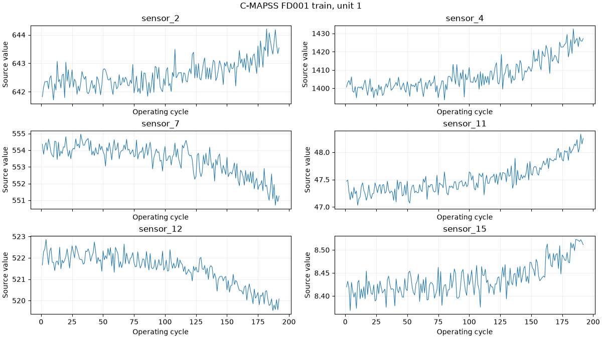
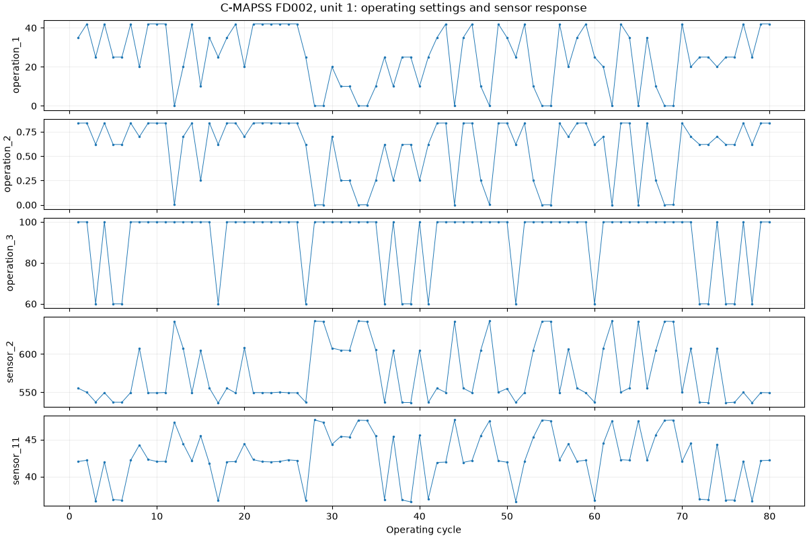

# C-MAPSS: Turbofan Engine Degradation

<!-- BEGIN GENERATED METADATA -->

## Dataset overview

A run-to-failure and remaining-useful-life benchmark for fleets of aircraft engines generated with NASA's C-MAPSS simulator.

| Item | Details |
|---|---|
| ID | `cmapss` |
| Name | Turbofan Engine Degradation Simulation Data Set |
| Provider | [NASA Prognostics Center of Excellence](https://www.nasa.gov/intelligent-systems-division/discovery-and-systems-health/pcoe/pcoe-data-set-repository/) |
| DOI | — |
| Availability | available (checked: 2026-09-06) |
| Access | Direct download from NASA |
| License | Unspecified |
| Commercial use | Unknown |
| Redistribution | Unknown |
| Data type | Multivariate run-to-failure time series |
| Feature dimensions | 24 input features: 21 sensor measurements + 3 operating settings |
| Feature counting | Applies to FD001–FD004 before dropping constant channels or engineering features. Unit ID and cycle index are excluded from the 26 raw columns; remaining useful life is a separate target. |
| Feature-count source | [NASA Prognostics Center of Excellence](https://www.nasa.gov/intelligent-systems-division/discovery-and-systems-health/pcoe/pcoe-data-set-repository/) |
| Tasks | RUL estimation, Prognostics, Anomaly detection |

## Experiment-task suitability

| Task | Support |
|---|---|
| Anomaly detection | Requires target derivation |
| Condition estimation | Requires target derivation |
| Remaining useful life prediction | Direct |
| Time-to-event prediction | Direct |
| Survival analysis | Direct |

## Attributes

| Attribute or group | Type | Role | Description |
|---|---|---|---|
| `unit_number` | UInt16 | entity | Identifier of the simulated engine. |
| `cycle` | UInt32 | time | Operating-cycle number. |
| `operation_1..3` | Float64 | operating-condition | Three operating settings that affect engine performance. |
| `sensor_1..21` | Float64 | sensor | Twenty-one sensor channels describing engine condition. |
| `RUL` | UInt32 | target | Optional uncapped per-cycle target when with_rul=True: train max(cycle)-cycle; test max(cycle)-cycle plus the official test-end offset. rul() returns offsets keyed by unit number; split="rul" retains the legacy single target column. |

## Usage notes

- FD001/FD003 have one operating condition; FD002/FD004 have six. FD001/FD002 have HPC degradation; FD003/FD004 include HPC and fan degradation modes. Per-cycle mode and onset labels are not supplied.
- Full local validation on 2026-09-06 confirmed 709 train and 707 test trajectories, 265,256 cycle rows with 26 finite values each, and 707 official test-end RUL offsets. All unit trajectories have consecutive cycles starting at 1.
- The bundled readme reverses the FD004 train/test trajectory counts. Actual files contain 249 train and 248 test engines; this catalog uses the observed counts.
- Each row is one operating-cycle observation, not a high-frequency waveform. No sampling rate in Hz or duration in seconds per cycle is supplied.
- Training trajectories end at failure. Test trajectories stop earlier; official RUL files give the number of cycles remaining after each test trajectory, in ascending unit-number order.
- Unit IDs are local to each subset and split. A training engine and a test engine with the same unit number are different trajectories.
- Default loading preserves all 26 columns. Unit selection and RUL augmentation are explicit; no smoothing, RUL cap, normalization, or constant-channel removal is applied.
- NASA does not specify a license in the dataset metadata, so this project does not classify it as CC0.

## Download

```bash
uv run --locked python scripts/download.py cmapss
```

Source archive: [turbofan-engine-degradation-simulation.zip](https://phm-datasets.s3.amazonaws.com/NASA/6.+Turbofan+Engine+Degradation+Simulation+Data+Set.zip)

## Suggested citation

Saxena, A. and Goebel, K. (2008). Turbofan Engine Degradation Simulation Data Set. NASA Ames Prognostics Data Repository.

<!-- END GENERATED METADATA -->

## Load an engine trajectory

```python
import pdmdata
from pdmdata.cmapss import load, inventory, rul, verify

pdmdata.download("cmapss")  # Explicit; reuses an existing local archive.
summary = inventory()      # All four subsets, train/test counts and cycle lengths.
engine = load("FD001", "train", unit=1, with_rul=True)
test_engine = load("FD001", "test", unit=1, with_rul=True)
test_offsets = rul("FD001")  # unit_number and RUL, aligned explicitly.
X = engine.select([f"sensor_{i}" for i in range(1, 22)])
# verify() checks all 12 data files against the full source inventory.
```

`pdmdata.load("cmapss", subset="FD001", split="train", unit=1)` uses the same
loader. Omitting `unit` returns every engine in that split. IDs start at 1 and
are local to `(subset, split)`; never join train unit 1 to test unit 1 as a
single trajectory. Unknown units and invalid selectors raise an error.

Train/test frames retain the 26 source columns by default. `with_rul=True`
adds a target column; it does not change the sensor values. The legacy
`load(split="rul")` returns a single RUL column in source order, while `rul()`
provides the corresponding unit IDs for explicit joins.

Files are stored under `data/raw/cmapss/` by default, controlled by the
[global configuration](../../docs/usage.md#global-configuration). Imports and
loaders never download data. Raw files, archives, and validation reports are
ignored by Git.

## Verified source inventory

| Subset | Train engines | Test engines | Train rows | Test rows | Operating conditions | Fault modes |
|---|---:|---:|---:|---:|---:|---|
| FD001 | 100 | 100 | 20,631 | 13,096 | 1 | HPC degradation |
| FD002 | 260 | 259 | 53,759 | 33,991 | 6 | HPC degradation |
| FD003 | 100 | 100 | 24,720 | 16,596 | 1 | HPC and fan degradation |
| FD004 | 249 | 248 | 61,249 | 41,214 | 6 | HPC and fan degradation |

There are 709 training and 707 test trajectories. The original readme swaps
FD004's train/test counts; the table above follows the actual source files and
248 test-end RUL labels for FD004. All eight trajectory matrices contain 26
columns: unit number, cycle, three operating settings, and 21 sensor values.

`inventory()` reads and validates source matrices and target alignment.
`verify()` additionally checks the complete expected engine and row counts.
Validation rejects missing/non-finite values, malformed rows, fractional IDs,
duplicate or skipped cycles, and invalid or misaligned RUL vectors.

## RUL semantics

For a training engine, RUL is `last_cycle - cycle`, reaching zero at the final
observation. For a test engine it is `last_observed_cycle - cycle + test_end_RUL`.
The final test observation therefore retains its official offset, rather than
being assigned zero. No cap is applied. This target counts remaining cycles;
it does not locate fault onset or assert degradation from the first cycle.

Test RUL is evaluation information. Keep it outside encoder inputs, feature
selection, normalization fitting, and segmentation threshold selection. The
files do not provide per-cycle health classes, fault modes, or segmentation
boundaries. Operating settings are observed inputs rather than categorical
state annotations.

## Sensor columns

The 21 measurements follow the sensor-output order in the bundled paper.
Values and units are retained from the source; no unit conversion is applied.

| Column | Symbol | Measurement | Unit |
|---|---|---|---|
| sensor_1 | T2 | Total temperature at fan inlet | deg R |
| sensor_2 | T24 | Total temperature at LPC outlet | deg R |
| sensor_3 | T30 | Total temperature at HPC outlet | deg R |
| sensor_4 | T50 | Total temperature at LPT outlet | deg R |
| sensor_5 | P2 | Pressure at fan inlet | psia |
| sensor_6 | P15 | Total pressure in bypass duct | psia |
| sensor_7 | P30 | Total pressure at HPC outlet | psia |
| sensor_8 | Nf | Physical fan speed | rpm |
| sensor_9 | Nc | Physical core speed | rpm |
| sensor_10 | epr | Engine pressure ratio | dimensionless |
| sensor_11 | Ps30 | Static pressure at HPC outlet | psia |
| sensor_12 | phi | Ratio of fuel flow to Ps30 | pps/psi |
| sensor_13 | NRf | Corrected fan speed | rpm |
| sensor_14 | NRc | Corrected core speed | rpm |
| sensor_15 | BPR | Bypass ratio | dimensionless |
| sensor_16 | farB | Burner fuel-air ratio | dimensionless |
| sensor_17 | htBleed | Bleed enthalpy | not specified |
| sensor_18 | Nf_dmd | Demanded fan speed | rpm |
| sensor_19 | PCNfR_dmd | Demanded corrected fan speed | rpm |
| sensor_20 | W31 | HPT coolant bleed | lbm/s |
| sensor_21 | W32 | LPT coolant bleed | lbm/s |

## Saved examples



The first training engine of FD001 illustrates cycle-level degradation under
one operating condition. The six plotted channels are an explicit subset;
the loader retains all sensors.



The first 80 cycles of FD002 training unit 1 show the three operating settings
alongside two sensors. Changes in operating conditions affect sensor values;
a visible jump alone is not a labeled degradation event.

The executed [C-MAPSS notebook](../../notebooks/datasets/cmapss.ipynb) contains
four saved Matplotlib figures, training-only feature-variability statistics,
and explicit train/test RUL examples. These static outputs render on GitHub.

## Use in dependency and segmentation research

Start with FD001 to examine sensor dependencies under one operating condition.
FD002/FD004 add condition changes, requiring a distinction between operating
regime and degradation. Each row is one cycle-level observation; the dataset
has no raw within-cycle waveform or documented Hz rate.

There are 21 sensor candidates, plus three operating settings that may be used
as context. Some channels are constant or nearly constant depending on the
subset. Fit feature selection and scaling using training engines, and keep
all windows from one engine in the same validation partition. Derived state
clusters must be identified as derived labels; RUL is not a segmentation label.

Source: the NASA distribution linked above, its `readme.txt`, and the bundled
*Damage Propagation Modeling for Aircraft Engine Run-to-Failure Simulation*
(Saxena, Goebel, Simon, and Eklund, 2008). Plots select source trajectories and
add labeled axes without changing the measurements.
