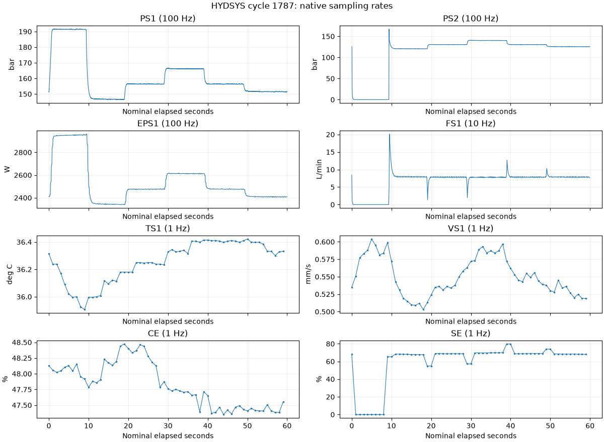

# Condition monitoring of hydraulic systems

<!-- BEGIN GENERATED METADATA -->

## Dataset overview

Repeated load cycles from a hydraulic test rig measured by 17 sensors at multiple sampling rates, with condition labels for four components.

| Item | Details |
|---|---|
| ID | `hydsys` |
| Name | Condition Monitoring of Hydraulic Systems |
| Provider | [UCI Machine Learning Repository](https://archive.ics.uci.edu/dataset/447/condition+monitoring+of+hydraulic+systems) |
| DOI | [10.24432/C5CW21](https://doi.org/10.24432/C5CW21) |
| Availability | available (checked: 2026-09-06) |
| Access | Direct ZIP download from UCI |
| License | [CC BY 4.0](https://creativecommons.org/licenses/by/4.0/) |
| Commercial use | Yes |
| Redistribution | Yes |
| Data type | Multirate multivariate time series |
| Feature dimensions | 17 sensor channels; 43,680 measurements per flattened 60-second cycle |
| Feature counting | Seven channels at 100 Hz contribute 6,000 samples each, two at 10 Hz contribute 600 each, and eight at 1 Hz contribute 60 each. A single-sensor load therefore has 6,000, 600, or 60 columns. The four condition targets and stability flag in profile.txt are excluded. |
| Feature-count source | [UCI Machine Learning Repository](https://archive.ics.uci.edu/dataset/447/condition+monitoring+of+hydraulic+systems) |
| Tasks | Fault classification, Condition estimation, Regression |

## Experiment-task suitability

| Task | Support |
|---|---|
| Fault or health-state classification | Direct |
| Condition estimation | Direct |

## Attributes

| Attribute or group | Type | Role | Description |
|---|---|---|---|
| `PS1..PS6` | Float64 | sensor | Pressure sensors sampled at 100 Hz, with 6,000 points per cycle. |
| `EPS1` | Float64 | sensor | Motor-power sensor sampled at 100 Hz, with 6,000 points per cycle. |
| `FS1..FS2` | Float64 | sensor | Volume-flow sensors sampled at 10 Hz, with 600 points per cycle. |
| `TS1..TS4` | Float64 | sensor | Temperature sensors sampled at 1 Hz, with 60 points per cycle. |
| `VS1` | Float64 | sensor | Vibration sensor sampled at 1 Hz, with 60 points per cycle. |
| `SE` | Float64 | sensor | Efficiency factor sampled at 1 Hz, with 60 points per cycle. |
| `CE` | Float64 | sensor | Virtual cooling-efficiency sensor sampled at 1 Hz. |
| `CP` | Float64 | sensor | Virtual cooling-power sensor sampled at 1 Hz. |
| `cooler_condition` | Int16 | target | Cooler efficiency [%], with values 3, 20, and 100. |
| `valve_condition` | Int16 | target | Valve switching condition [%], with values 73, 80, 90, and 100. |
| `internal_pump_leakage` | UInt8 | target | Internal pump leakage: 0 none, 1 weak, and 2 severe. |
| `hydraulic_accumulator` | Int16 | target | Hydraulic accumulator pressure [bar]. |
| `stable_flag` | UInt8 | quality-flag | 0 indicates stable conditions; 1 indicates that steady state may not have been reached. |

## Usage notes

- The dataset contains 2,205 labeled 60-second cycles and 17 channels: seven at 100 Hz, two at 10 Hz, and eight at 1 Hz.
- There are 43,680 scalar measurements per cycle and 96,314,400 across all cycles. These counts flatten time and channels; the simultaneous channel count is 17, or seven when selecting only the 100 Hz group.
- Cycle IDs in the Python API are zero-based (0 through 2204) and match profile rows. Conditions label whole cycles, not within-cycle phase boundaries.
- load_cycle returns separate frames keyed by native sampling rate, without interpolation. time_s is constructed as sample/rate; the raw matrices contain no timestamps.
- All 17 matrices and profile.txt were validated for shape, finite measurements, target values, and matching cycle counts; no missing values were found.
- stable_flag=0 means stable conditions; 1 means that steady state may not have been reached. Stability does not imply healthy components.
- VS1 is sampled at 1 Hz. CE and CP are virtual channels; their derived nature matters when interpreting dependence graphs.

## Download

```bash
uv run --locked python scripts/download.py hydsys
```

Source archive: [condition-monitoring-of-hydraulic-systems.zip](https://archive.ics.uci.edu/static/public/447/condition+monitoring+of+hydraulic+systems.zip)

## Suggested citation

Helwig, N., Pignanelli, E. and Schütze, A. (2015). Condition Monitoring of a Complex Hydraulic System Using Multivariate Statistics.

<!-- END GENERATED METADATA -->

## Load a cycle and its labels

```python
import pdmdata
from pdmdata.datasets.hydsys import profile, load_cycle, inventory
from pdmdata.datasets.hydsys.viz import plot_cycle

labels = profile()              # 2,205 rows: cycle ID and five target/quality fields
cycle = 1787                    # Zero-based cycle ID
signals = load_cycle(cycle)      # Separate 100 Hz, 10 Hz, and 1 Hz frames
fast = signals[100]             # 6,000 rows: sample, time_s, and seven signals
figure = plot_cycle(signals, cycle=cycle)
```

Select a smaller set with `load_cycle(0, sensors=["PS1", "PS2", "EPS1"])[100]`.
For a single sensor, `pdmdata.load("hydsys", sensor="PS1", cycle=0)` returns a
long frame with sample, time_s, and PS1. Omitting cycle retains the matrix API:
`pdmdata.load("hydsys", sensor="PS1")` returns 2,205 rows by 6,000 columns.
`inventory()` reads and validates all matrices against the profile.

Run `pdmdata.download("hydsys")` explicitly if needed. Loading, profile, and
inventory read only local data and respect the configured data root.

## Native data dimensions

| Sampling rate | Channels | Samples per channel per cycle | Channels in group |
|---|---:|---:|---|
| 100 Hz | 7 | 6,000 | PS1–PS6, EPS1 |
| 10 Hz | 2 | 600 | FS1–FS2 |
| 1 Hz | 8 | 60 | TS1–TS4, VS1, CE, CP, SE |

There are **2,205 cycles**, **17 channels**, and **96,314,400 scalar measurements**.
The 43,680-value flattened representation is one whole cycle, not 43,680 sensors.
The loader preserves native sampling rates. The nominal within-cycle time axis
starts at zero and excludes the 60-second endpoint. No recorded wall-clock
alignment between successive cycles is inferred.

## Condition targets

| Target | Values and meanings |
|---|---|
| Cooler (%) | 100: full efficiency; 20: reduced efficiency; 3: near failure |
| Valve (%) | 100: optimal switching; 90: small lag; 80: severe lag; 73: near failure |
| Pump leakage | 0: none; 1: weak; 2: severe |
| Accumulator (bar) | 130: optimal; 115: slightly reduced; 100: severely reduced; 90: near failure |
| Stability flag | 0: stable; 1: steady state may not have been reached |

Each profile row describes one cycle. These are component-condition references,
not labels for the changing load phases inside that cycle. Keep targets separate
from sensor-only inputs. The dataset does not supply RUL labels.

## Real waveform example

The [HYDSYS notebook](../../../notebooks/datasets/hydsys.ipynb) includes complete
sensor validation, label distributions, condition tracks, a native-rate cycle
view, a two-second 100 Hz zoom, and valve comparisons with the other labels fixed.
It saves Matplotlib outputs for GitHub.



Eight selected signals from cycle 1787, the first stable cycle with cooler 100%,
valve 100%, pump leakage 0, and accumulator pressure 130 bar. Slower channels are
shown on their own native time axes; the figure does not upsample them.

For dependency analysis, the seven 100 Hz channels provide a directly aligned
input. Avoid treating repeated low-rate values as additional independent samples,
and account for derived CE/CP signals. Neighboring cycles share condition settings;
evaluate with cycle groups or temporal blocks instead of randomly mixing windows.

Source: Helwig, Pignanelli, and Schütze, [UCI dataset](https://doi.org/10.24432/C5CW21).
The preview selects channels and adds labeled axes to the source measurements.
Data license: [CC BY 4.0](https://creativecommons.org/licenses/by/4.0/).
