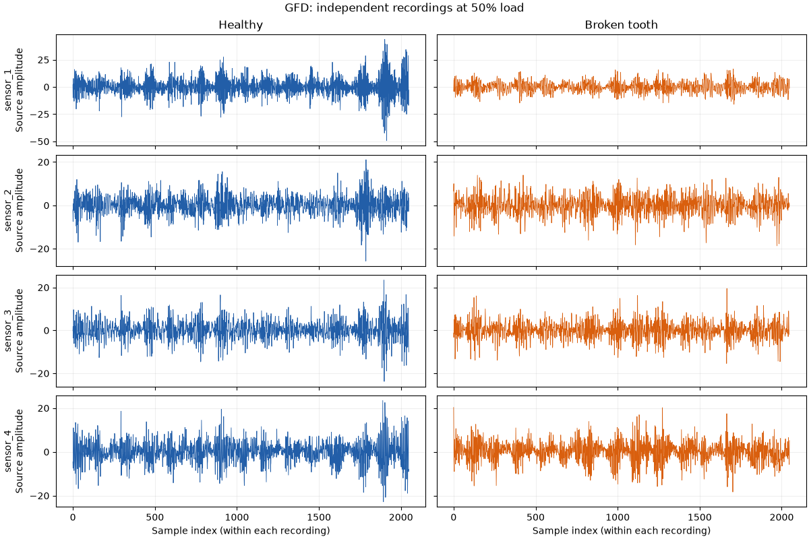

# Gearbox Fault Diagnosis

<!-- BEGIN GENERATED METADATA -->

## Dataset overview

Vibration signals recorded in four directions from a two-stage gearbox with healthy and broken-tooth gears under varying load.

| Item | Details |
|---|---|
| ID | `gfd` |
| Name | Gearbox Fault Diagnosis Data |
| Provider | [Open Energy Data Initiative](https://data.openei.org/submissions/623) |
| DOI | — |
| Availability | available (checked: 2026-09-06) |
| Access | Direct download |
| License | [CC BY 4.0](https://creativecommons.org/licenses/by/4.0/) |
| Commercial use | Yes |
| Redistribution | Yes |
| Data type | Vibration time series |
| Feature dimensions | 4 vibration channels per sample |
| Feature counting | Counts the four accelerometer channels. Gear condition and load level are experiment metadata; the loader adds them as columns. Using load as an additional input gives 5 features before feature engineering. |
| Feature-count source | [Open Energy Data Initiative](https://data.openei.org/submissions/623) |
| Tasks | Fault classification, Signal analysis |

## Experiment-task suitability

| Task | Support |
|---|---|
| Anomaly detection | Requires target derivation |
| Fault or health-state classification | Direct |

## Attributes

| Attribute or group | Type | Role | Description |
|---|---|---|---|
| `sensor_1..sensor_4` | Float64 | sensor | Four vibration channels from the headerless, tab-delimited source files; amplitudes are preserved as supplied. |
| `condition` | Categorical | target | Healthy (h) or broken-tooth (b) condition encoded in the file name. |
| `load` | UInt8 | operating-condition | Load from 0% through 90% in 10% increments, encoded in the file name. |

## Usage notes

- The dataset contains 20 files: two conditions at ten load levels.
- Condition and load are encoded in file names rather than CSV columns.
- The raw files contain no timestamps or column headers. This package does not infer a sampling rate from the 30hz filename token; plots use sample index.
- Each file is a separate condition/load recording. There are no within-recording state-transition annotations; concatenating files would create artificial boundaries.

## Download

```bash
uv run --locked python scripts/download.py gfd
```

Source archive: [gearbox-fault-diagnosis.zip](https://data.openei.org/files/623/gearboxdata.zip)

## Suggested citation

Pandya, Y. and Parey, A. Gearbox Fault Diagnosis Data. OpenEI submission 623.

<!-- END GENERATED METADATA -->

## Explore vibration recordings

The [GFD notebook](../../notebooks/datasets/gfd.ipynb) includes a complete local
inventory, healthy/broken waveform comparisons, a short zoom, RMS by load, and
sensor correlations. Its Matplotlib outputs are saved for viewing on GitHub.

```python
import pdmdata
from pdmdata.gfd import inventory
from pdmdata.gfd.viz import plot_waveforms

inventory()  # Validate all 20 local recordings and report sample counts.
healthy = pdmdata.load("gfd", condition="healthy", load=50)
broken = pdmdata.load("gfd", condition="broken", load=50)
figure = plot_waveforms(healthy, broken, start=0, stop=2048)
```

Run `pdmdata.download("gfd")` explicitly if data is missing. Loading and inventory
never download data. Load accepts 0 through 90 in steps of 10; condition accepts
`"healthy"` or `"broken"`. The loader returns four floating-point sensor columns
plus condition and load, preserving measurement order. Incomplete measurements
raise an error instead of silently removing rows.

### Real waveform example



The first 2,048 samples of two independent recordings, with identical y-axis
scales per sensor. Source amplitudes and sample indices are retained; the raw
files do not provide timestamps or a sampling-rate field. The notebook saves
this preview without copying raw measurements into the repository.

### Research interpretation

GFD provides four sensor dimensions and condition/load labels at the recording
level. It does not provide annotated state changes within a recording.
Concatenated recordings would produce synthetic boundaries, so use GDD or
MetroPT2 alongside GFD when studying naturally evolving operating sequences.
Pearson correlation plots describe marginal association, not conditional
independence or a learned Graphical Lasso model.
