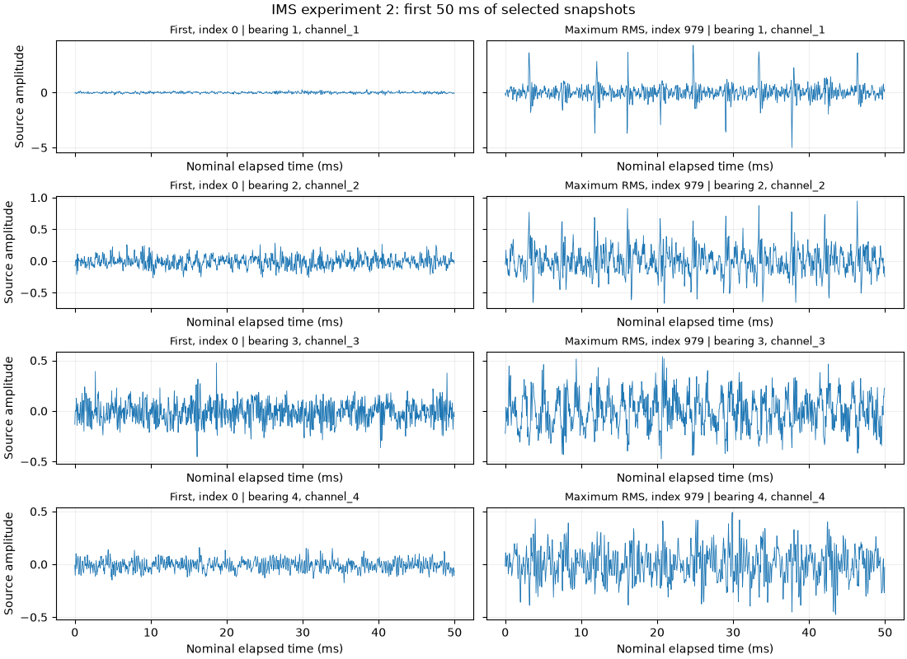

# IMS Bearings

<!-- BEGIN GENERATED METADATA -->

## Dataset overview

Run-to-failure vibration measurements from accelerated bearing degradation experiments conducted by the Center for Intelligent Maintenance Systems.

| Item | Details |
|---|---|
| ID | `ims` |
| Name | IMS Bearings |
| Provider | [NASA Prognostics Center of Excellence](https://www.nasa.gov/intelligent-systems-division/discovery-and-systems-health/pcoe/pcoe-data-set-repository/) |
| DOI | — |
| Availability | available (checked: 2026-09-06) |
| Access | Direct NASA-linked S3 download; nested ZIP, 7z, and RAR extraction with libarchive |
| License | [U.S. Government Works](https://www.usa.gov/government-works) |
| Commercial use | Unknown |
| Redistribution | Unknown |
| Data type | Run-to-failure vibration time series |
| Feature dimensions | Experiment 1: 8 vibration channels; experiments 2 and 3: 4 channels |
| Feature counting | Counts simultaneous accelerometer channels, excluding sample/time columns and recording identifiers. Experiment 1 has two channels per bearing; experiments 2 and 3 have one per bearing. Each snapshot nominally contains 20,480 observations per channel at the documented 20 kHz rate; time samples are not separate feature dimensions. |
| Feature-count source | [NASA distribution and bundled IMS readme PDF](https://www.nasa.gov/intelligent-systems-division/discovery-and-systems-health/pcoe/pcoe-data-set-repository/) |
| Tasks | Fault diagnosis, Degradation estimation, Prognostics |

## Experiment-task suitability

| Task | Support |
|---|---|
| Anomaly detection | Requires target derivation |
| Fault or health-state classification | Requires target derivation |
| Condition estimation | Requires target derivation |
| Remaining useful life prediction | Requires target derivation |
| Time-to-event prediction | Requires target derivation |
| Survival analysis | Requires target derivation |

## Attributes

| Attribute or group | Type | Role | Description |
|---|---|---|---|
| `sample` | UInt32 | time | Zero-based sample index within the selected recording. |
| `time_s` | Float64 | time | Nominal seconds within the snapshot: sample / 20000. |
| `channel_1..8` | Float64 | sensor | Eight channels for experiment 1; four for experiments 2 and 3. Source amplitudes are retained without unit conversion. |
| `recording_time` | Datetime | timestamp | Timezone-naive timestamp parsed from the source filename, constant within a snapshot. |
| `experiment` | UInt8 | entity | Experiment ID: 1, 2, or 3. |
| `recording` | String | entity | Original timestamp filename, constant within a snapshot. |

## Usage notes

- The NASA-linked ZIP contains IMS.7z, which contains three RAR archives and the original readme PDF. download("ims") expands every layer using libarchive; imports and loaders never download.
- There are three independent experiments and 9,464 source snapshots: 2,156 in experiment 1, 984 in experiment 2, and 6,324 in experiment 3.
- Full local validation on 2026-09-06 confirmed 20,480 samples in every recording, the documented channel counts, and no missing or non-finite measurements: 193,822,720 sample rows and 951,910,400 scalar measurements in total.
- The bundled PDF states 4,448 files ending April 4, 2004 for experiment 3; the distributed 3rd_test.rar instead contains 6,324 files under 4th_test/txt, ending April 18, 2004. This nested directory is part of experiment 3, not a fourth experiment. The extension is not explained by the PDF.
- The source describes one-second snapshots with 20,480 points sampled at 20 kHz. The loader uses the stated rate, giving 1.024 seconds per 20,480 sample periods; it does not substitute 20.48 kHz.
- Filename timestamps preserve acquisition gaps. Recordings are normally ten minutes apart; the first 43 files of experiment 1 were taken about five minutes apart. Do not concatenate raw snapshots into a continuous high-rate signal.
- Documented end-of-test outcomes: experiment 1 has bearing 3 inner-race and bearing 4 roller-element defects; experiment 2 has bearing 1 outer-race failure; experiment 3 has bearing 3 outer-race failure. No per-sample onset or switching-state annotations are supplied.
- The archive chronology discrepancy in experiment 3 prevents treating its final file as an independently verified failure endpoint without further justification.
- The catalog record points to the U.S. Government Works policy; users should review the source terms before redistribution.

## Download

```bash
uv run --locked python scripts/download.py ims
```

Source archive: [IMS.zip](https://phm-datasets.s3.amazonaws.com/NASA/4.+Bearings.zip)

## Suggested citation

J. Lee, H. Qiu, G. Yu, J. Lin, and Rexnord Technical Services (2007). IMS, University of Cincinnati. Bearing Data Set. NASA Prognostics Data Repository, NASA Ames Research Center, Moffett Field, CA.

<!-- END GENERATED METADATA -->


## Local loading

```python
import pdmdata
from pdmdata.ims import inventory, load, channel_info, rms_history, verify

pdmdata.download("ims")  # Explicit download and extraction; existing archives are reused.
files = inventory()      # One row per recording, with timestamps and byte sizes.
frame = load(0, experiment=2)
frame = load("2004.02.12.10.32.39", experiment=2)
X = frame.select(channel_info(2)["channel"].to_list())  # 20,480 x 4
subset = load(0, experiment=1, channels=["channel_5", "channel_6"])
history = rms_history(2)  # One RMS value per channel per recording.
# verify() checks every matrix and the complete experiment recording counts.
```

`pdmdata.load("ims", experiment=2, recording=0)` uses the same loader.
Recording indices are zero-based within an experiment and sorted by filename
chronology. Omitting both selectors loads the first recording of experiment 2.
An exact filename without an experiment searches all experiments and rejects
ambiguous matches. The loader validates the complete source matrix even when
only selected channels are returned. It never joins separate snapshots.

The default data directory is `data/raw/ims/`. It contains the original ZIP,
nested source archives, extracted recordings, and a SHA-256 manifest. Raw data
and validation reports are ignored by Git. The [global configuration](../../docs/usage.md#global-configuration)
controls the location. See [archive requirements](../../docs/usage.md#downloading-datasets)
if the native libarchive library is unavailable.

## Experiment inventory

| Experiment | Source recordings | Channels | First filename timestamp | Last filename timestamp |
|---|---:|---:|---|---|
| 1 | 2,156 | 8 | 2003-10-22 12:06:24 | 2003-11-25 23:39:56 |
| 2 | 984 | 4 | 2004-02-12 10:32:39 | 2004-02-19 06:22:39 |
| 3 | 6,324 | 4 | 2004-03-04 09:27:46 | 2004-04-18 02:42:55 |

Counts refer to the current NASA-linked archive, not the smaller experiment 3
inventory described in the bundled PDF. `inventory()` is lightweight; it does
not validate matrix contents. `verify()` checks counts, dimensions, and finite
values across all recordings while reading one file at a time.

## Bearing assignments and targets

| Experiment | Channel mapping | Documented end-of-test defects |
|---|---|---|
| 1 | Bearings 1/2/3/4 correspond to channel pairs 1–2/3–4/5–6/7–8 | Bearing 3: inner race; bearing 4: roller element |
| 2 | Channel number equals bearing number | Bearing 1: outer race |
| 3 | Channel number equals bearing number | Bearing 3: outer race |

These are test outcomes rather than per-row health labels. The source describes
two accelerometer axes per bearing for experiment 1. Amplitudes are preserved
as published; the bundled PDF does not specify their numerical unit.
A bearing with no reported fault is not assigned a healthy label by the loader.

## Saved waveform examples



The preview shows the first 50 ms of experiment 2 recordings 0 and 979, with
common amplitude limits per channel. Recording 979 has the largest channel 1
RMS among the 984 snapshots. This explicit extreme-value selection illustrates
increased vibration; it is not a representative random sample. The final two
recordings have near-zero amplitudes on all channels and are retained in the
notebook and loader without assigning an operating-state label.

The executed [IMS notebook](../../notebooks/datasets/ims.ipynb) also includes
full snapshots, RMS over all 984 experiment 2 recordings, and an experiment 3
comparison. Static Matplotlib outputs render directly on GitHub.

## Research use

Four or eight simultaneous channels give a compact sensor graph. High-frequency
within-snapshot dependencies and slow degradation across snapshots are separate
time scales; the long gaps do not contain observed vibration. Keep time and
entity columns outside the model features, fit scaling only on training data,
and keep windows from one recording together in chronological or grouped splits.
There are only three independent runs. No ground-truth within-waveform state
segmentation is supplied, and experiment 3's extended archive chronology needs
separate justification before deriving RUL from its last timestamp.

Source: the NASA distribution linked above and its bundled
*Readme Document for IMS Bearing Data.pdf*. The preview selects two snapshots
and adds labeled axes; source amplitudes are unchanged.
