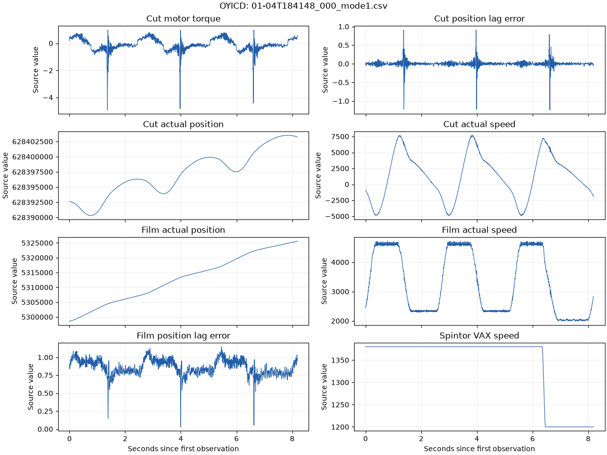

# One Year Industrial Component Degradation

<!-- BEGIN GENERATED METADATA -->

## Dataset overview

High-frequency machine measurements tracking cutting-blade degradation in an industrial shrink-wrapper over twelve months.

| Item | Details |
|---|---|
| ID | `oyicd` |
| Name | One Year Industrial Component Degradation |
| Provider | [inIT-OWL on Kaggle](https://www.kaggle.com/datasets/inIT-OWL/one-year-industrial-component-degradation) |
| DOI | — |
| Availability | available (checked: 2026-09-06) |
| Access | Kaggle |
| License | [CC BY-SA 3.0](https://creativecommons.org/licenses/by-sa/3.0/) |
| Commercial use | Yes |
| Redistribution | Yes |
| Data type | Multivariate degradation time series |
| Feature dimensions | 8 process signals per sample |
| Feature counting | Excludes timestamp from the 9-column recording schema. Counts motor torque, controller positions, speeds, and lag errors; operating modes identify recordings rather than adding sensor dimensions. |
| Feature-count source | [inIT-OWL on Kaggle](https://www.kaggle.com/datasets/inIT-OWL/one-year-industrial-component-degradation) |
| Tasks | Degradation estimation, Anomaly detection, Operating-mode classification, RUL research |

## Experiment-task suitability

| Task | Support |
|---|---|
| Anomaly detection | Requires target derivation |
| Operating-state classification | Direct |
| Condition estimation | Requires target derivation |
| Remaining useful life prediction | Requires target derivation |
| Time-to-event prediction | Requires target derivation |
| Survival analysis | Requires target derivation |

## Attributes

| Attribute or group | Type | Role | Description |
|---|---|---|---|
| `timestamp` | Float64 | time | Time within an approximately eight-second recording sampled at four-millisecond intervals. |
| `pCut::*, pSvolFilm::*, pSpintor::*` | Float64 | sensor | Eight process signals: cutting-motor torque; cutting and film controller positions, speeds and lag errors; and Spintor speed. Values retain their source scale. |
| `filename` | String | entity | Recording identifier encoding month, day, start time, sample number, and operating mode. |
| `mode` | UInt8 | operating-condition | Operating mode from 1 through 8 encoded in the source filename. |
| `month` | UInt8 | degradation-time | Relative month from 1 through 12 encoded in the source filename. |

## Usage notes

- The distribution contains 519 unique CSV recordings, each with 2,048 samples (1,062,912 unique observations).
- Source filenames follow MM-DDTHHMMSS_NUM_modeX.csv, where MM is a relative month rather than a calendar month.
- Component replacement, failure time, and RUL are not explicitly labeled and require interpretation from degradation trends.
- Download and any required authentication are handled by the official Kaggle CLI.
- The Kaggle ZIP contains two byte-identical copies of every recording. Loading and inventory verify duplicate agreement and count each filename only once.
- Operating modes label entire recordings. Within-recording cycle phases, wear levels, and state-transition boundaries are not annotated.

## Download

```bash
uv run --locked python scripts/download.py oyicd
```

Kaggle dataset: [`inIT-OWL/one-year-industrial-component-degradation`](https://www.kaggle.com/datasets/inIT-OWL/one-year-industrial-component-degradation)

## Suggested citation

von Birgelen, A., Buratti, D., Mager, J. and Niggemann, O. (2018). Self-Organizing Maps for Anomaly Localization and Predictive Maintenance in Cyber-Physical Production Systems.

<!-- END GENERATED METADATA -->


## Explore local recordings

The [OYICD notebook](../../notebooks/datasets/oyicd.ipynb) includes recording
coverage by month and mode, an eight-signal overview, a one-second zoom, and a
motor-torque example for each mode. Matplotlib outputs are saved for GitHub.

```python
import pdmdata
from pdmdata.oyicd import inventory
from pdmdata.oyicd.viz import plot_waveforms

files = inventory(month=1, mode=1)
frame = pdmdata.load("oyicd", recording=files["filename"][0])
figure = plot_waveforms(frame)
```

Use `pdmdata.download("oyicd")` explicitly if data is missing. Download uses the
Kaggle authentication flow described in the [project README](../../README.md).
Loading and inventory never download data. Inventory validates local recordings,
compares duplicate copies, and supports month (1–12) and mode (1–8) filters.
Conflicting copies, missing measurements, and non-increasing timestamps raise
errors. Original downloaded files remain unchanged.

## Real waveform example



Recording `01-04T184148_000_mode1.csv`, with all 2,048 observations. Elapsed time
is relative to its first timestamp; values retain their source scale. The
notebook generates this compact preview without copying raw CSVs into Git.

Source: [inIT-OWL on Kaggle](https://www.kaggle.com/datasets/inIT-OWL/one-year-industrial-component-degradation),
associated with von Birgelen et al. (2018). The source data and this derived
preview are provided under [CC BY-SA 3.0](https://creativecommons.org/licenses/by-sa/3.0/).
The preview changes the presentation to a labeled eight-panel plot.

## Research interpretation

The eight process signals offer a small multivariate system with fast motion
cycles. However, these are short, separate captures across twelve relative
months, not a continuous year-long time series. Modes label entire captures;
they do not label phases within a cycle. Keep filename modes and relative months
outside sensor-only inputs, inspect accumulated-position trends and constants,
and prevent duplicate captures or overlapping windows from crossing evaluation
splits. Relative month is not a measured blade-wear or RUL target.
