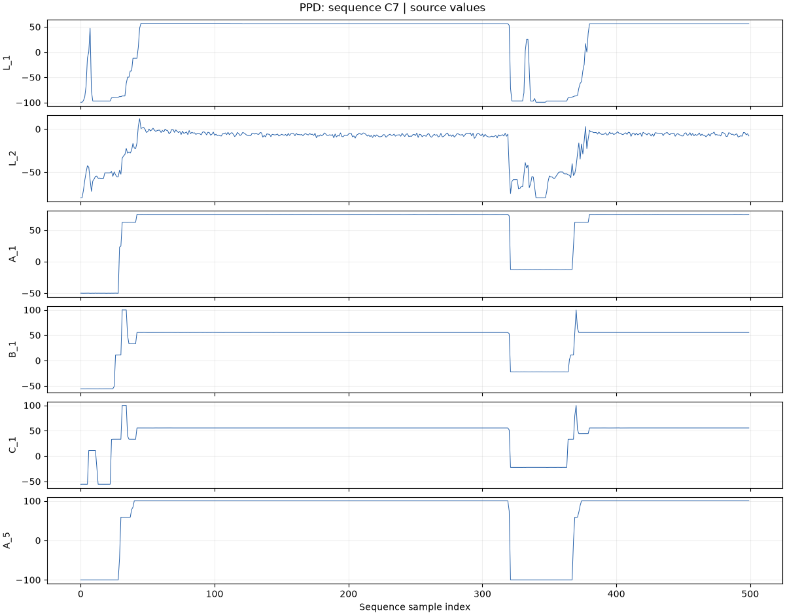

# Production Plant Data for Condition Monitoring

<!-- BEGIN GENERATED METADATA -->

## Dataset overview

Eight run-to-failure sequences with 25 process signals and 228,424 observations for production-plant condition monitoring. Sequences C7 and C13 each combine two ordered source files.

| Item | Details |
|---|---|
| ID | `ppd` |
| Name | Production Plant Data for Condition Monitoring |
| Provider | [inIT-OWL on Kaggle](https://www.kaggle.com/datasets/inIT-OWL/production-plant-data-for-condition-monitoring) |
| DOI | — |
| Availability | available (checked: 2026-09-06) |
| Access | Kaggle |
| License | [CC BY-SA 3.0](https://creativecommons.org/licenses/by-sa/3.0/) |
| Commercial use | Yes |
| Redistribution | Yes |
| Data type | Run-to-failure time series |
| Feature dimensions | 25 process signals per sample |
| Feature counting | Counts L_1–L_10, A_1–A_5, B_1–B_5, and C_1–C_5. Timestamp and loader-added sample, sequence_id, and source_file columns are excluded. |
| Feature-count source | [inIT-OWL on Kaggle](https://www.kaggle.com/datasets/inIT-OWL/production-plant-data-for-condition-monitoring) |
| Tasks | Degradation estimation, Anomaly detection, RUL research |

## Experiment-task suitability

| Task | Support |
|---|---|
| Anomaly detection | Requires target derivation |
| Condition estimation | Requires target derivation |
| Remaining useful life prediction | Requires target derivation |
| Time-to-event prediction | Requires target derivation |
| Survival analysis | Requires target derivation |

## Attributes

| Attribute or group | Type | Role | Description |
|---|---|---|---|
| `Timestamp` | Integer | time | Original per-file observation index, preserved verbatim including resets at joined part boundaries. Use sample for a continuous sequence index. |
| `L_1..L_10` | Float64 | sensor | Source process-signal family. Values and names are preserved; physical units and detailed channel semantics are not established by the CSV files. |
| `A_1..A_5` | Float64 | sensor | Source process-signal family. Values and names are preserved; physical units and detailed channel semantics are not established by the CSV files. |
| `B_1..B_5` | Float64 | sensor | Source process-signal family. Values and names are preserved; physical units and detailed channel semantics are not established by the CSV files. |
| `C_1..C_5` | Float64 | sensor | Source process-signal family. Values and names are preserved; physical units and detailed channel semantics are not established by the CSV files. |
| `sample` | UInt32 | index | Zero-based continuous row index across all parts of the loaded sequence. |
| `sequence_id` | UInt8 | entity | Sequence number after C: 7, 8, 9, 11, 13, 14, 15, or 16. Use this ID for Leave-One-Out splits. |
| `source_file` | String | provenance | Original CSV filename for each row; preserves source-part boundaries. |

## Sequence statistics

Computed from the eight complete sequences returned by inventory(). Sample counts include missing rows. Lengths are observation counts, not physical durations.

| Statistic | Value |
|---|---:|
| Sequences | 8 |
| Total samples | 228,424 |
| Minimum sequence length | 15,803 |
| Maximum sequence length | 51,671 |
| Mean sequence length | 28,553 |
| Rows with missing signals | 12 |

| Sequence ID | Samples | Rows with missing signals |
|---|---:|---:|
| 7 | 51,671 | 4 |
| 8 | 15,803 | 0 |
| 9 | 34,245 | 0 |
| 11 | 18,429 | 0 |
| 13 | 23,670 | 0 |
| 14 | 32,848 | 4 |
| 15 | 30,737 | 4 |
| 16 | 21,021 | 0 |
| **Total** | **228,424** | **12** |

## Usage notes

- The evaluation unit is a complete sequence: eight sequences and eight Leave-One-Out folds. Ten CSVs are the underlying storage files, not ten independent sequences.
- The number after C is the sequence ID. Hyphenated parts are concatenated in order: C7-1 then C7-2, and C13-1 then C13-2.
- Leave-One-Out evaluation holds out one complete sequence in each of eight folds. Source parts of a sequence must remain in the same fold.
- The loader preserves all measurement values and missing rows, adds a continuous sample index, and retains the original Timestamp and source_file. It does not infer interruption duration.
- Sequences C7, C14, and C15 each contain four rows missing all 25 signals (12 rows and 300 missing values in total). These rows are retained in sequence lengths.
- The provider describes run-to-failure experiments. For an endpoint-based RUL benchmark, derive remaining sample count from the complete sequence endpoint rather than individual file endpoints.
- Explicit per-sample wear, fault, and state annotations are not distributed. Timestamp physical units are not established by the CSVs.
- The provider describes selecting eight features for an analysis; the raw recording schema contains 25 process signals.

## Download

```bash
uv run --locked python scripts/download.py ppd
```

Kaggle dataset: [`inIT-OWL/production-plant-data-for-condition-monitoring`](https://www.kaggle.com/datasets/inIT-OWL/production-plant-data-for-condition-monitoring)

## Suggested citation

von Birgelen, A. et al. (2018). Self-Organizing Maps for Anomaly Localization and Predictive Maintenance in Cyber-Physical Production Systems.

<!-- END GENERATED METADATA -->

## Load a complete sequence

```python
import pdmdata
from pdmdata.ppd import SEQUENCE_IDS, inventory, load_file
from pdmdata.ppd.viz import plot_waveforms

frame = pdmdata.load("ppd", sequence_id=7)  # C7-1 followed by C7-2
other = pdmdata.load("ppd", sequence_id=13)  # C13-1 followed by C13-2
inventory()  # Eight rows, one per complete sequence
figure = plot_waveforms(frame, columns=["L_1", "L_2", "A_1"], start=0, stop=500)
```

Supported IDs are `7, 8, 9, 11, 13, 14, 15, 16`. Numeric strings and C-prefixed
strings such as `"7"` and `"C7"` are also accepted. The default is sequence 7.
`pdmdata.ppd.load(7)` provides the same dataset-specific API.

The `sample` column runs continuously from zero across joined parts. `Timestamp`
keeps each source file's original index, while `source_file` identifies its rows.
Missing measurements remain in place. Part order is explicit; missing required
parts raise an error. Raw files are never modified. To inspect a single source
part, use `load_file("C7-1")`; it retains the local Timestamp and has no combined
sample index. The earlier `load(experiment="C7-1")` API is replaced by these APIs.

If needed, explicitly call `pdmdata.download("ppd")` using the Kaggle setup in the
[project README](../../README.md). Loading and inventory never download data.

## Leave-One-Out evaluation

```python
sequences = {i: pdmdata.load("ppd", sequence_id=i) for i in SEQUENCE_IDS}
for test_id in SEQUENCE_IDS:
    train = {i: frame for i, frame in sequences.items() if i != test_id}
    test = sequences[test_id]
    # Fit preprocessing and the model using train only, then evaluate test.
```

This produces eight folds. C7's two files and C13's two files belong to their
respective single sequences and cannot be split between training and evaluation.
For an endpoint-based RUL benchmark, derive `RUL(i) = sequence_length - 1 - i`
using `sample` as i. The target is in sample-count units and reaches zero only at
the end of the complete sequence. RUL is a derived target; cycle-phase or wear
labels are not stored in the source CSVs.

## Explore waveforms

The [PPD notebook](../../notebooks/datasets/ppd.ipynb) includes all eight sequences,
source-part provenance, missing-value checks, whole-sequence waveforms, a zoom,
sequence comparisons, and a Leave-One-Out partition example. Its Matplotlib
outputs are saved for GitHub; dashed vertical markers identify joined parts.



First 500 observations of sequence C7, using six channels for readability. Values
retain their source scale. The horizontal axis is a continuous sequence sample
index. No gap duration or physical sampling interval is inferred.

Source: [inIT-OWL on Kaggle](https://www.kaggle.com/datasets/inIT-OWL/production-plant-data-for-condition-monitoring),
associated with von Birgelen et al. (2018),
[original paper](https://doi.org/10.1016/j.procir.2018.03.150).
Source data and this derived preview are provided under
[CC BY-SA 3.0](https://creativecommons.org/licenses/by-sa/3.0/).
The preview selects a short interval and presents six channels in labeled panels.
